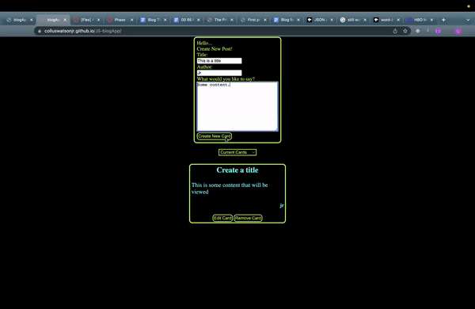
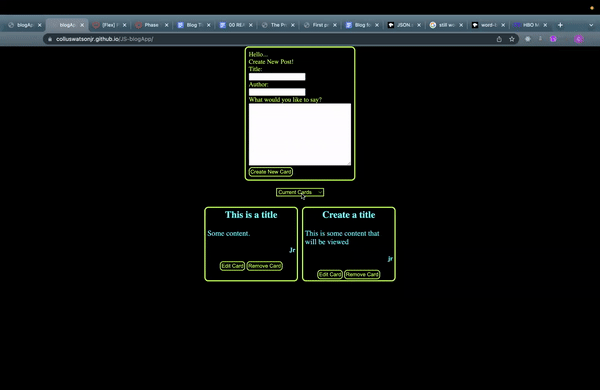
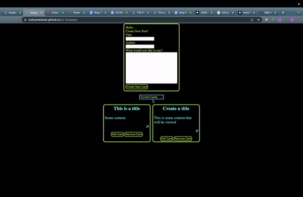
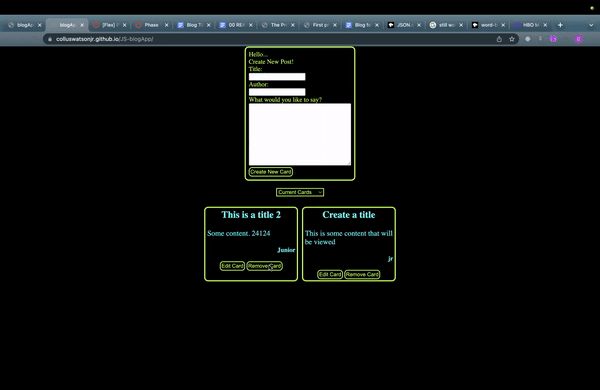
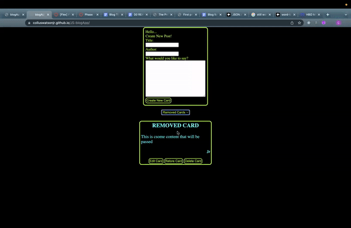
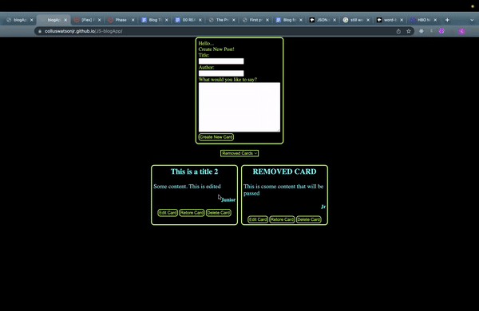

# JS blogApp project
**version 1.0.0**

---
## Purpose
A blogApp created with html/css/javascript. blogApp allows users to create, edit, remove, and delete cards.

---
## Created with
html / css / javascript / json-server / visual studio code

---

## How to use!

> Download Json Server (https://www.npmjs.com/package/json-server)

>Download Git (https://github.com/colluswatsonjr/js-project-01) 

>Start Json Server for db.json file (json-server --watch db.json)
---
https://youtu.be/4obm1wpIv64

>Create Card:

>Select Cards:

>Edit Card:

>Remove Card:

>Restore Card:

>Delete Card:

---